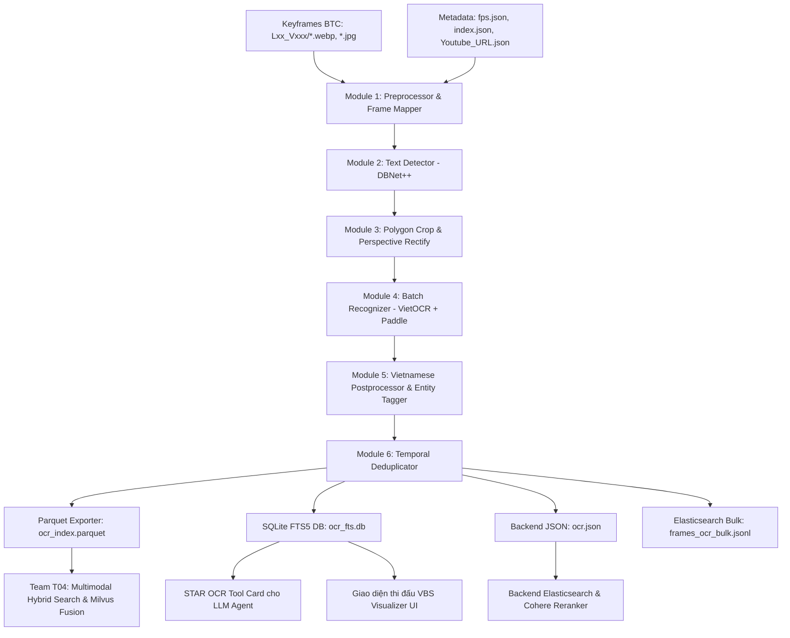

# 📘 HƯỚNG DẪN SỬ DỤNG HỆ THỐNG OCR & TEXT RETRIEVAL
## AI Challenge TP.HCM 2026 (Bảng A) - Module OCR (T02)

---

## 1. Tổng quan Hệ thống

Hệ thống OCR & Spatial Text Retrieval được thiết kế chuyên biệt cho cuộc thi **AI Challenge TP.HCM 2026**, tối ưu hóa trực tiếp cho 3 bài toán truy vấn:
1. **Textual KIS (Known Item Search)**: Tìm chính xác video và frame chứa biển hiệu, bảng quảng cáo, tên đường, tên quán.
2. **Visual Q&A (Question Answering)**: Trích xuất các thực thể cụ thể như **Giá tiền (`PRICE`)**, **Biển số xe (`LICENSE_PLATE`)**, **Số điện thoại (`PHONE_NUMBER`)**, **Số lượng (`NUMBER`)**, **Thời gian (`TIME`)** để trả lời câu hỏi.
3. **TRAKE (Temporal Retrieval & Alignment)**: Căn chỉnh chuỗi sự kiện theo dòng thời gian.



---

## 2. Cấu trúc Thư mục

```text
d:/AIC2026/
├── configs/
│   └── ocr_config.yaml            # File cấu hình toàn bộ hệ thống
├── data/
│   ├── ocr_results/               # Thư mục xuất kết quả (.parquet, .db, .json)
│   │   ├── ocr_fts.db             # CSDL SQLite FTS5 tìm kiếm < 3ms
│   │   ├── ocr_index.parquet      # Dữ liệu bảng chuẩn cho Multimodal RAG
│   │   ├── ocr.json               # Ánh xạ frame_id cho Backend Video Retrieval
│   │   └── frames_ocr_bulk.jsonl  # Nạp trực tiếp vào Elasticsearch frames_ocr
│   └── sample_benchmark.json      # File ground truth mẫu đánh giá điểm
├── scripts/
│   ├── run_indexing.py            # CLI quét & index toàn bộ dataset
│   ├── search_cli.py              # CLI tìm kiếm nhanh trên terminal
│   ├── visualizer_app.py          # Web App VBS Studio (FastAPI)
│   └── evaluate_retrieval.py      # Đánh giá R@k & Final Score chuẩn BTC
├── src/
│   └── ocr/
│       ├── __init__.py            # Export package
│       ├── preprocessor.py        # Laplacian blur score, CLAHE & Metadata Mapper
│       ├── detector.py            # DBNet++ detection & Perspective Transform
│       ├── recognizer.py          # Hybrid VietOCR + PaddleOCR
│       ├── postprocessor.py       # Chuẩn hóa tiếng Việt & Regex Entity
│       ├── deduplicator.py        # Gộp text qua các frame liền kề
│       ├── indexer.py             # SQLite FTS5, Parquet, JSON & ES Exporter
│       ├── agent_tool.py          # Spatial Tool Card cho LLM Agent (STAR)
│       └── pipeline.py            # End-to-End Orchestrator
├── tests/                         # Bộ kiểm thử tự động (17 unit tests)
├── .gitignore                     # Cấu hình loại trừ file rác, weights & datasets
├── requirements.txt               # Danh sách thư viện
└── README.md                      # Hướng dẫn chi tiết
```

---

## 3. Cài đặt Môi trường (Environment Setup)

Nếu môi trường `.venv` đã được tạo sẵn, bạn chỉ cần kích hoạt và sử dụng:

```powershell
# Kích hoạt môi trường ảo trên Windows PowerShell
.\.venv\Scripts\Activate.ps1

# (Tùy chọn) Cài đặt lại thư viện nếu cần
pip install -r requirements.txt
```

---

## 4. Hướng dẫn Sử dụng Từng Bước (Workflow)

### Bước 1: Điều chỉnh Cấu hình (`configs/ocr_config.yaml`)

Trước khi chạy dữ liệu lớn, bạn có thể chỉnh tham số phù hợp với phần cứng trong `configs/ocr_config.yaml`:
- `pipeline.device`: `"cuda"` (nếu có GPU NVIDIA) hoặc `"cpu"`.
- `recognizer.batch_size`: `64` (mặc định cho GPU 8GB VRAM) hoặc `16` (cho CPU).
- `preprocessor.enable_adaptive_clahe`: `true` (tăng tương phản cho ảnh tối).

---

### Bước 2: Quét Keyframes và Đánh Chỉ mục (`run_indexing.py`)

Hệ thống hỗ trợ 2 cách chạy tùy thuộc vào cấu trúc dataset:

#### Cách 1: Chạy theo danh sách `index.json` (Khuyến nghị cho AIC 2026 - 190k keyframes WebP)
Cách này đảm bảo **`frame_id` (0..190821)** được đồng bộ tuyệt đối 1-to-1 với kho vector Milvus (CLIP H/14, SigLIP2, BEiT3):

```powershell
.venv\Scripts\python scripts/run_indexing.py `
    --keyframes_dir "AIC2026/data/keyframe/keyframe" `
    --index_json "AIC2026/data/keyframe/keyframe/index.json" `
    --fps_file "AIC2026/data/metadata/fps.json" `
    --youtube_urls "AIC2026/data/metadata/Youtube_URL.json" `
    --output_dir "data/ocr_results"
```

#### Cách 2: Quét trực tiếp theo thư mục Keyframes (`.webp`, `.jpg`, `.png`)
```powershell
.venv\Scripts\python scripts/run_indexing.py `
    --keyframes_dir "AIC2026/data/keyframe/keyframe" `
    --fps_file "AIC2026/data/metadata/fps.json" `
    --youtube_urls "AIC2026/data/metadata/Youtube_URL.json" `
    --output_dir "data/ocr_results"
```

**Các file kết quả được sinh ra tại `data/ocr_results/`:**
1. `ocr_fts.db`: CSDL SQLite FTS5 tìm kiếm siêu tốc (< 3ms), kèm link YouTube & `frame_id`.
2. `ocr_index.parquet`: Bảng dữ liệu chuẩn cho Multimodal Hybrid Fusion & Milvus vector join.
3. `ocr.json`: File JSON ánh xạ `frame_id` cho Backend Video Retrieval & Reranker.
4. `frames_ocr_bulk.jsonl`: File nạp trực tiếp vào Elasticsearch `frames_ocr`.

---

### Bước 2.1: Nạp OCR vào Backend Elasticsearch (`ingest-ocr`)

Nếu bạn sử dụng cụm Backend Video Retrieval của cuộc thi:
```powershell
# Nạp từ file ocr.json vừa trích xuất
.venv\Scripts\python -m ingestion.cli ingest-ocr --ocr-file "data/ocr_results/ocr.json" --recreate
```

---

### Bước 3: Tìm kiếm Nhanh trên Terminal (`search_cli.py`)

Dùng để tra cứu tức thời từ khóa khi đang thi đấu:

```powershell
.venv\Scripts\python scripts/search_cli.py --db data/ocr_results/ocr_fts.db
```

**Ví dụ tương tác:**
```text
🔎 Nhập từ khóa tìm kiếm: cơm tấm ba ghiền
⚡ Thời gian truy vấn: 1.85 ms

Top  | FrameID  | Video ID   | Frame   | Time       | Conf   | Detected Text              | KIS Payload    
---------------------------------------------------------------------------------------------------------
1    | 150      | L21_V001   | 150     | 00:05.000  | 0.95   | Cơm Tấm Ba Ghiền 45k       | L21_V001, 150  

📋 GỢI Ý SUBMISSION (TOP CHO BTC AIC 2026):
▶ [Textual KIS Format: <video_id>, <frame_idx>]
   Top 1: L21_V001, 150 (https://youtube.com/watch?v=Rzpw5WR7nAY&t=5s)
▶ [Visual Q&A Format: <video_id>, <frame_idx>, <answer>]
   Top 1: L21_V001, 150, 45k
```

---

### Bước 4: Mở Giao diện Web VBS Visualizer Studio (`visualizer_app.py`)

Giao diện Web đồ họa hiện đại hỗ trợ người vận hành (Operator) quan sát trực quan:

```powershell
.venv\Scripts\python scripts/visualizer_app.py `
    --db "data/ocr_results/ocr_fts.db" `
    --keyframes_dir "AIC2026/data/keyframe/keyframe" `
    --index_json "AIC2026/data/keyframe/keyframe/index.json" `
    --port 8000
```
- Mở trình duyệt tại: **`http://127.0.0.1:8000`**
- **Tính năng:**
  - Hiển thị tức thời ảnh keyframe `.webp`, `.jpg` qua tra cứu $O(1)$ từ `index.json`.
  - Nút **`▶ YouTube`** mở trực tiếp video trên YouTube tại đúng giây xuất hiện từ khóa.
  - Tìm kiếm mờ tiếng Việt có dấu và không dấu (gõ *"ba ghien"*, *"59-x3"*).
  - Bấm chọn các chip lọc nhanh: `💰 Giá tiền`, `🚗 Biển số xe`, `📞 SĐT`, `🔢 Con số`, `⏰ Thời gian`.
  - Nút **`Copy KIS`** và **`Copy Q&A`** trực tiếp trên từng card kết quả để dán vào hệ thống nộp bài của BTC.
  - Nút **`Copy Top 100 KIS Payload`** xuất toàn bộ 100 dòng kết quả tốt nhất chỉ với 1 click.

---

### Bước 5: Đánh giá Điểm số theo Quy chế BTC (`evaluate_retrieval.py`)

Chạy script đánh giá tự động để tính điểm $R@k$ và $Final\ Score$:

```powershell
.venv\Scripts\python scripts/evaluate_retrieval.py --db data/ocr_results/ocr_fts.db --benchmark data/sample_benchmark.json
```

**Công thức tính điểm của BTC:**
$$\text{Final Score} = \frac{1}{5} \sum_{k \in \{1, 5, 20, 50, 100\}} R@k$$

---

### Bước 6: Tích hợp vào AI Agent / LLM Planner (STAR Framework)

Nếu bạn xây dựng AI Agent lập luận tự động (GPT-4o, Claude 3.7, Gemini 2.0/3.0) theo Slide Buổi 3:

```python
from src.ocr.agent_tool import SpatialOCRTool

# Khởi tạo công cụ
tool = SpatialOCRTool("data/ocr_results/ocr_fts.db")

# 1. Agent tìm kiếm văn bản trong video
hits = tool.tool_search_ocr(query_text="cơm sườn 45k", top_k=5)

# 2. Agent đọc toàn bộ text trong 1 frame cụ thể
frame_info = tool.tool_read_frame_text(video_id="L01_V001", frame_idx=150)

# 3. Agent phóng to đọc text trong một vùng ROI [ymin, xmin, ymax, xmax]
roi_info = tool.tool_inspect_roi(video_id="L01_V001", frame_idx=150, roi=[0.1, 0.2, 0.3, 0.8])

# 4. Lấy JSON Schemas để truyền vào OpenAI / Gemini Function Calling
schemas = SpatialOCRTool.get_tool_schemas()
```

---

## 5. Quy định Định dạng Nộp bài của BTC (Cheat Sheet)

| Loại Truy vấn | Định dạng Chuỗi Nộp Bài | Ví dụ Minh Họa |
| :--- | :--- | :--- |
| **1. Textual KIS** | `<video_id>, <frame_id>` | `L01_V001, 150` |
| **2. Visual Q&A** | `<video_id>, <frame_id>, <answer>` | `L01_V001, 150, 45k` hoặc `L05_V005, 888, màu xanh` |
| **3. TRAKE** | `<video_id>, <frame_id1>, <frame_id2>, ...` | `L10_V010, 101, 150, 203, 251` |

---

## 6. Chạy Kiểm tra Hệ thống (Unit Tests)

Bất kỳ lúc nào bạn muốn kiểm tra tính toàn vẹn của mã nguồn:

```powershell
.venv\Scripts\python -m unittest discover tests
```
Tất cả 17 unit tests sẽ chạy và báo `OK`.
